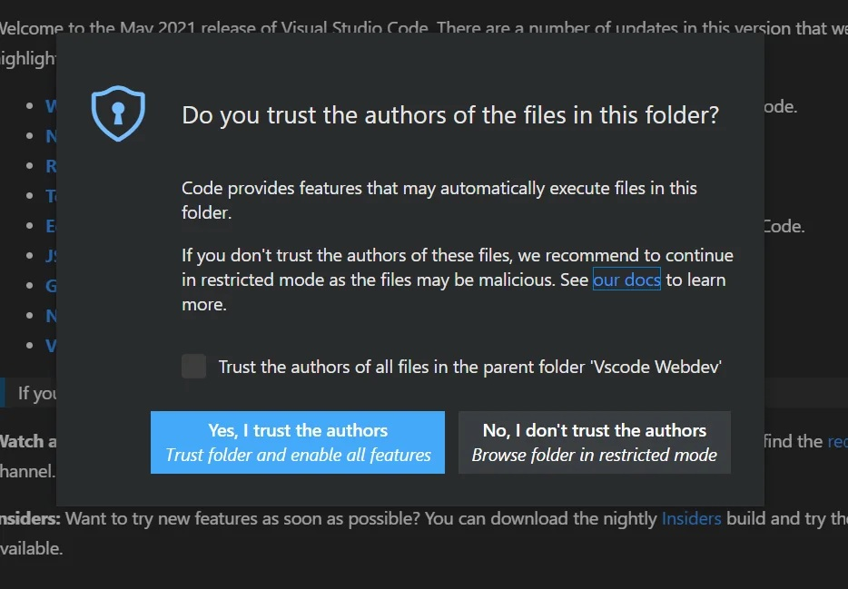
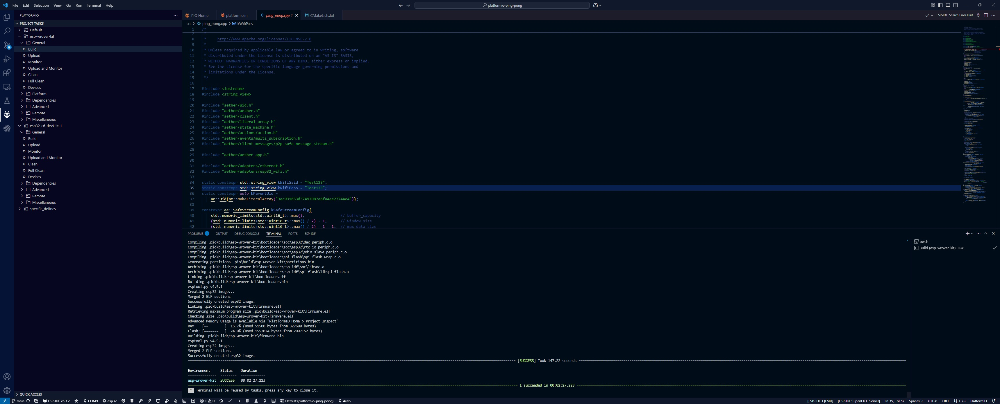
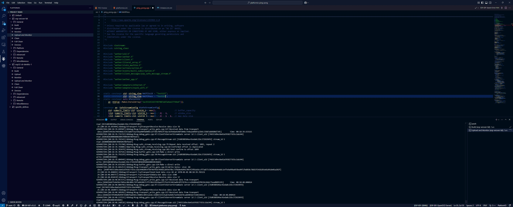

# Ping Pong for Platformio

This is a simple ping pong example using the *aether* client library. It registers two clients, *Alice* and *Bob*. *Alice* sends "ping", and *Bob* responds with "pong".
This is the simplest example, but it covers many features of the *aether* library: `aether_app`, objects, actions, events, and streams.

## Build
Just open this folder in the Platformio IDE. For the question "Do you trust the author of the files in this folder" answer "Yes, I trust the authors".

Change your WiFi SSID/PASS in the ping_pong.cpp
```cpp
static constexpr std::string_view kWifiSsid = "Test123";
static constexpr std::string_view kWifiPass = "Test123";
```
Open the Platformio menu. Select your board and click on the "Build" menu item.

After successful compilation, download the firmware by selecting the menu item "Upload and Monitor"


## Dive deep
### The recipe to build
We are using **CMake** for now. Though some considered it industry standard other build systems also would be supported in the future.
Lib `aether` requires at least *c++17*, so require it on your project and look at the nex code snippet.

```cmake
# add user provided config which will be included as regular .h file
# Add a user-provided config file, which will be included as a regular .h file
set(USER_CONFIG "user_config.h" CACHE PATH "" FORCE)
# ${USER_CONFIG} must be an absolute path or a path to something listed in include directories
include_directories(${CMAKE_CURRENT_LIST_DIR}/src)
```

There are two modes in which *aether* operates: [distillation mode](https://aethernet.io/documentation#c++2) and production mode.
By default, *aether* builds in distillation mode, to select production mode set AE_DISTILLATION_MODE option to Off.
In distillation mode, *aether* configures all its inner objects to default states and saves them to the file system.
Check the `build/state` directory.
In production mode, *aether* only loads objects with saved states from `./state`.
This not only saves time and code required to configure large objects but, more importantly, allows the use of saved states between application runs.

To configure the *aether* library, we use a configuration header file. All configuration options with their default values are listed in `aether/config.h`.
However, users can provide their own configuration through the `USER_CONFIG` option.
This must be an absolute path or a path relative to something listed in the include directories (compilers `-I` option).


### Where It All Begins
```cpp
auto aether_app = ae::AetherApp::Construct(
    ae::AetherAppContext{}
#if defined AE_DISTILLATION
        .AdapterFactory([](ae::AetherAppContext const& context) {
#  if defined ESP32_WIFI_ADAPTER_ENABLED
          auto adapter = context.domain().CreateObj<ae::Esp32WifiAdapter>(
              ae::GlobalId::kEsp32WiFiAdapter, context.aether(),
              context.poller(), context.dns_resolver(),
              std::string(kWifiSsid), std::string(kWifiPass));
#  else
          auto adapter = context.domain().CreateObj<ae::EthernetAdapter>(
              ae::GlobalId::kEthernetAdapter, context.aether(),
              context.poller(), context.dns_resolver());
#  endif
          return adapter;
        })
#endif
);

std::unique_ptr<Alice> alice;
std::unique_ptr<Bob> bob;
TimeSynchronizer time_synchronizer;

// register or load clients
auto alice_client = aether_app->aether()->SelectClient(kParentUid, "Alice");
auto bob_client = aether_app->aether()->SelectClient(kParentUid, "Bob");

auto wait_clients = ae::CumulativeEvent<ae::Client::ptr, 2>{
    [&](auto event, auto status) {
      status.OnResult([&](auto& action) { event = action.client(); })
          .OnError([&]() { aether_app->Exit(1); });
    },
    alice_client->StatusEvent(), bob_client->StatusEvent()};

// Create a subscription to the Result event
wait_clients.Subscribe([&](auto const& event) {
  if (aether_app->IsExited()) {
    return;
  }
  auto client_alice = event[0];
  auto client_bob = event[1];
  alice = ae::make_unique<Alice>(*aether_app, std::move(client_alice),
                                 time_synchronizer, client_bob->uid());
  bob = ae::make_unique<Bob>(*aether_app, std::move(client_bob),
                             time_synchronizer);
  // Save the current aether state
  aether_app->domain().SaveRoot(aether_app->aether());
});

while (!aether_app->IsExited()) {
  auto next_time = aether_app->Update(ae::Now());
  aether_app->WaitUntil(next_time);
}
return aether_app->ExitCode();
```

Let's go through this!

First, create `aether_app` — it's the single object in the *aether* library that rules them all. It creates, initializes, and provides access to the root `aether` object.
It also includes helper functions like `Update` and `WaitUntil` to easily integrate it into your update/event loop. To properly construct it `ae::AetherAppContext` and specify custom adapter factory for it. Usually the default factories are enough, but here we create `Esp32WifiAdapter` with provided `kWifiSsid` and `kWifiPass` to connect to the WiFi network.

Define our main characters, *Alice* and *Bob*.

Select *Alice* and *Bob* clients from `aether`. We can't get them directly,
because they may be loaded from saved state or registered in Aether - both are asynchronous.
Thats why `alice_client` and `bob_client` are `SelectClientAction` type.
An [action](https://aethernet.io/technology#action2) in *aether* is a concept for performing asynchronous operations.
Each action inherits from `ae::Action<T>` and is registered in the [ActionProcessor](https://aethernet.io/technology#action2) infrastructure.
It has an `Update` method invoked every loop, where we can manage a state machine or check the status of multithreaded tasks.
To inform about its state, StatusEvent [events](https://aethernet.io/documentation#c++2) exists which inform us about three statuses:
`Result`, `Error`, and `Stop` — the names speak for themselves.

We are using `CumulativeEvent` to combine different `StatusEvent`s into one. Successful client selection allows us to obtain client objects for *alice* and *bob*. On any failure, we close the application with exit code 1.

For this example, clients for `Alice` and `Bob` are registered every time the application runs in distillation mode.
However, in production mode, clients from the saved state are used.
Reconfigure CMake with `AE_DISTILLATION=Off` (just run `cmake -DAE_DISTILLATION=Off .` in your build directory) and rebuild it.
The next run will be slightly faster without registration.

### Alice
```cpp
Alice::Alice(ae::AetherApp& aether_app, ae::Client::ptr client_alice,
             TimeSynchronizer& time_synchronizer, ae::Uid bobs_uid)
    : aether_app_{&aether_app},
      client_alice_{std::move(client_alice)},
      time_synchronizer_{&time_synchronizer},
      p2pstream_{
          client_alice_->message_stream_manager().CreateStream(bobs_uid)},
      interval_sender_{*aether_app_, [this]() { SendMessage(); },
                       std::chrono::milliseconds{5000},
                       ae::RepeatableTask::kRepeatCountInfinite},
      receive_data_sub_{p2pstream_->out_data_event().Subscribe(
          ae::MethodPtr<&Alice::ResponseReceived>{this})} {}

void Alice::SendMessage() {
  auto current_time = ae::Now();
  constexpr std::string_view ping_message = "ping";

  time_synchronizer_->SetPingSentTime(current_time);

  std::cout << ae::Format("[{:%H:%M:%S}] Alice sends \"ping\"'\n", ae::Now());
  auto send_action =
      p2pstream_->Write({std::begin(ping_message), std::end(ping_message)});

  // notify about error
  send_subs_.Push(
      send_action->StatusEvent().Subscribe(ae::OnError{[&](auto const&) {
        std::cerr << "ping send error" << '\n';
        aether_app_->Exit(1);
      }}));
}

void Alice::ResponseReceived(ae::DataBuffer const& data_buffer) {
  auto pong_message = std::string_view{
      reinterpret_cast<char const*>(data_buffer.data()), data_buffer.size()};
  std::cout << ae::Format(
      "[{:%H:%M:%S}] Alice received \"{}\" within time {} ms\n", ae::Now(),
      pong_message,
      std::chrono::duration_cast<std::chrono::milliseconds>(
          time_synchronizer_->GetPongDuration())
          .count());
}
```

*Alice* saves a pointer to the `aether_app` object, stores `client_alice`, and creates entities where all the business magic happens.
She knows *Bob*'s [`uid`](https://aethernet.io/technology#registering-new-client0) and doesn't mind chatting with him.

Create `p2pstream_`. It's a [`P2pSafeStream`](https://aethernet.io/documentation#c++2),
where *Safe* means it guarantees or makes every effort to deliver *Alice's* message to *Bob*.
Think of [streams](https://aethernet.io/documentation#c++2) as tunnels through the internet and Aethernet servers to another client.
They are full-duplex, so you can send messages through the tunnel and receive responses simultaneously.

*Alice* uses `RepeatableTask` — another action — to send her "pings" periodically with specified interval. It runs `SendMessage` every 5 seconds. And `ResponseReceived` will be invoked when new data received through the stream.

To properly manage event subscriptions life time *Alice* uses `ae::Subscription`.
[Event subscription](https://aethernet.io/documentation#c++2) is a RAII object that holds a subscription to events and unsubscribes upon destruction.

### Bob
```cpp
Bob::Bob(ae::AetherApp& aether_app, ae::Client::ptr client_bob,
         TimeSynchronizer& time_synchronizer)
    : aether_app_{&aether_app},
      client_bob_{std::move(client_bob)},
      time_synchronizer_{&time_synchronizer},
      new_stream_receive_sub_{
          client_bob_->message_stream_manager().new_stream_event().Subscribe(
              ae::MethodPtr<&Bob::OnNewStream>{this})} {}

void Bob::OnNewStream(ae::RcPtr<ae::P2pStream> message_stream) {
  p2pstream_ = std::move(message_stream);
  message_receive_sub_ = p2pstream_->out_data_event().Subscribe(
      ae::MethodPtr<&Bob::OnMessageReceived>{this});
}

void Bob::OnMessageReceived(ae::DataBuffer const& data_buffer) {
  auto ping_message = std::string_view{
      reinterpret_cast<char const*>(data_buffer.data()), data_buffer.size()};
  std::cout << ae::Format(
      "[{:%H:%M:%S}] Bob received \"{}\" within time {} ms\n", ae::Now(),
      ping_message,
      std::chrono::duration_cast<std::chrono::milliseconds>(
          time_synchronizer_->GetPingDuration())
          .count());

  time_synchronizer_->SetPongSentTime(ae::Now());
  constexpr std::string_view pong_message = "pong";
  std::cout << ae::Format("[{:%H:%M:%S}] Bob sends \"pong\"\n", ae::Now());
  p2pstream_->Write({std::begin(pong_message), std::end(pong_message)});
}
```

*Bob* forgot to ask for *Alice*'s number (uid) and hopes she might message him first.
He subscribes to the `new_stream_event` of his Aethernet connection.
When *Alice* sends the first message to the stream, Aethernet routes it directly to *Bob* through the server.
*Bob* then creates a `P2pSafeStream` with the same properties as *Alice*'s, allowing him to parse, decrypt, and receive her exact message.
Excited, and not wanting to keep her waiting, *Bob* promptly sends his "pong" in response.

## The End
I couldn't find the strength to stop their chatting. So, once you're tired of them, just power off your board.
